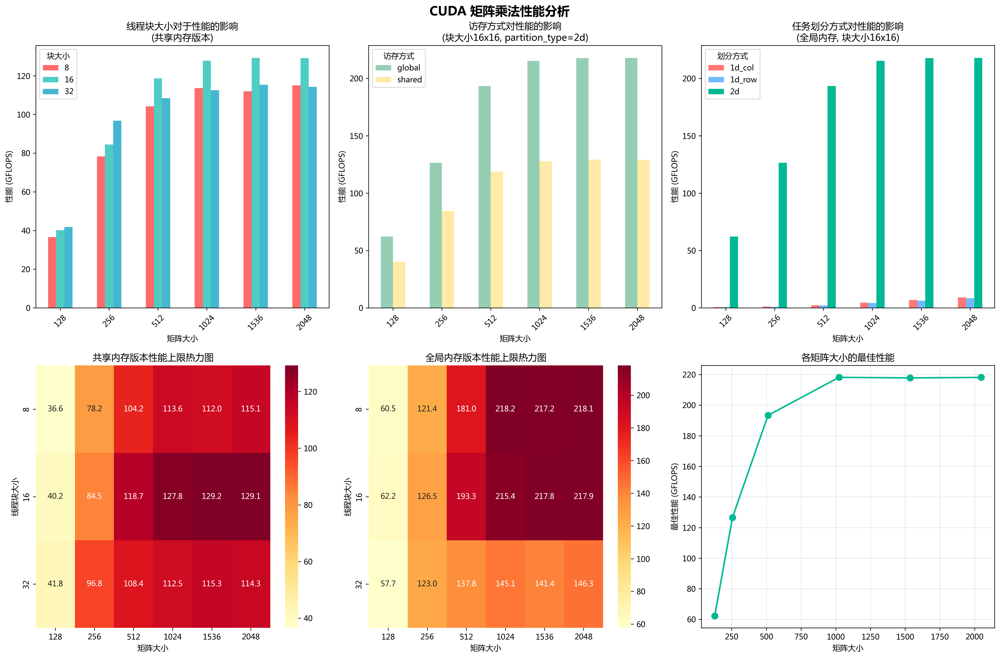

# CUDA矩阵乘法性能分析实验报告

## 1. 实验目的

1. 使用CUDA实现并行矩阵乘法算法
2. 分析不同实现方式对性能的影响：
   - 线程块大小（8x8, 16x16, 32x32）
   - 访存方式（全局内存vs共享内存）
   - 任务划分方式（2D划分、1D行划分、1D列划分）
3. 通过实验数据分析CUDA程序的性能优化方法

## 2. 实验过程和核心代码

### 2.1 基础实现 - 全局内存版本

基础版本直接使用全局内存，每个线程计算结果矩阵中的一个元素：

```cpp
__global__ void matrixMulBasic(float* A, float* B, float* C, int m, int n, int k) {
    int row = blockIdx.y * blockDim.y + threadIdx.y;
    int col = blockIdx.x * blockDim.x + threadIdx.x;
    
    if (row < m && col < k) {
        float sum = 0.0f;
        for (int i = 0; i < n; i++) {
            sum += A[row * n + i] * B[i * k + col];
        }
        C[row * k + col] = sum;
    }
}
```

这个实现的特点是：
1. 使用2D线程块和2D网格组织线程
2. 每个线程负责计算结果矩阵中的一个元素
3. 直接从全局内存读取数据，访存效率较低

### 2.2 共享内存优化版本

共享内存版本通过分块计算来提高访存效率：

```cpp
template<int TILE_SIZE>
__global__ void matrixMulShared(float* A, float* B, float* C, int m, int n, int k) {
    __shared__ float As[TILE_SIZE][TILE_SIZE];
    __shared__ float Bs[TILE_SIZE][TILE_SIZE];
    
    int bx = blockIdx.x, by = blockIdx.y;
    int tx = threadIdx.x, ty = threadIdx.y;
    
    int row = by * TILE_SIZE + ty;
    int col = bx * TILE_SIZE + tx;
    
    float sum = 0.0f;
    
    for (int t = 0; t < (n + TILE_SIZE - 1) / TILE_SIZE; t++) {
        // 加载数据到共享内存
        if (row < m && t * TILE_SIZE + tx < n)
            As[ty][tx] = A[row * n + t * TILE_SIZE + tx];
        else
            As[ty][tx] = 0.0f;
            
        if (col < k && t * TILE_SIZE + ty < n)
            Bs[ty][tx] = B[(t * TILE_SIZE + ty) * k + col];
        else
            Bs[ty][tx] = 0.0f;
            
        __syncthreads();
        
        for (int i = 0; i < TILE_SIZE; i++) {
            sum += As[ty][i] * Bs[i][tx];
        }
        
        __syncthreads();
    }
    
    if (row < m && col < k) {
        C[row * k + col] = sum;
    }
}
```

优化要点：
1. 使用共享内存缓存数据块，减少全局内存访问
2. 使用模板参数TILE_SIZE控制分块大小
3. 使用`__syncthreads()`确保数据同步
4. 处理了矩阵维度不是TILE_SIZE整数倍的情况

### 2.3 一维数据划分版本

实现了两种一维划分方式：

1. 按行划分：每个线程块处理一行
2. 按列划分：每个线程块处理一列

这两种实现主要用于对比不同任务划分方式的性能差异。

## 3. 实验结果

通过运行性能分析脚本，得到了不同配置下的性能数据，生成了综合分析图表：



从图表可以得出以下结论：

### 3.1 线程块大小对性能的影响（共享内存版本）

左上角第一个柱状图

矩阵越大，性能提升越明显。

16×16的线程块表现最佳，相比8×8和32×32获得了更高的GFLOPS。

8×8线程块性能最差，可能是因为线程块过小，导致SM利用率不足，且共享内存加载次数较多。

32×32块略逊于16×16，可能是由于占用共享内存较多，导致资源调度瓶颈（如寄存器或共享内存超标）。

总体说明：合理的线程块大小（如16×16）在保证并发度的同时也能充分利用共享内存的带宽优势。

### 3.2 访存方式对性能的影响

上排中间柱状图

比较全局内存和共享内存实现（固定块大小16×16）。

全局内存版本始终优于共享内存版本，性能优势最明显在较大矩阵（如1024及以上）。

这可能是`__syncthreads`导致的，线程的等待降低了效率


### 3.3 任务划分方式对性能的影响
上排右侧柱状图

比较1D列划分、1D行划分、2D划分（全局内存版本，固定块大小16×16）。

2D划分方式性能远高于1D划分方式，几乎是数量级上的差异。

这说明在CUDA中，线程块和网格的二维映射更能有效利用并行计算资源，同时保证内存访问的空间局部性。

1D行划分优于1D列划分，可能是因为数据按行存储，行访问更符合CUDA的coalesced访问要求。

### 3.4 性能热力图分析（共享内存与全局内存）

左下和中下两个热力图

共享内存版本（左下图）：
性能瓶颈和上限主要出现在矩阵大小较小或线程块过小时（如8×8）。

最佳性能区集中在16×16线程块 + 较大矩阵尺寸（1024以上）。

热区集中且分布合理，说明共享内存带来了稳定且高效的性能收益。

全局内存版本（中下图）：

和共享内存版本类似，但是性能更优

### 3.5 不同矩阵大小的最优性能

右下角折线图

展示了每个矩阵大小对应的最佳实现性能。

性能曲线快速上升并趋于饱和，在矩阵大小达到1024后性能基本稳定。

表明矩阵足够大时可以充分发挥GPU的并行计算能力，此时瓶颈由计算资源转向访存或带宽。


## 4. 实验感想

性能优化心得：

- CUDA程序的性能优化主要在于减少访存延迟和提高并行度
- 共享内存的方法并不总是提高性能
- 线程块大小的选择需要在资源利用和调度开销之间权衡
