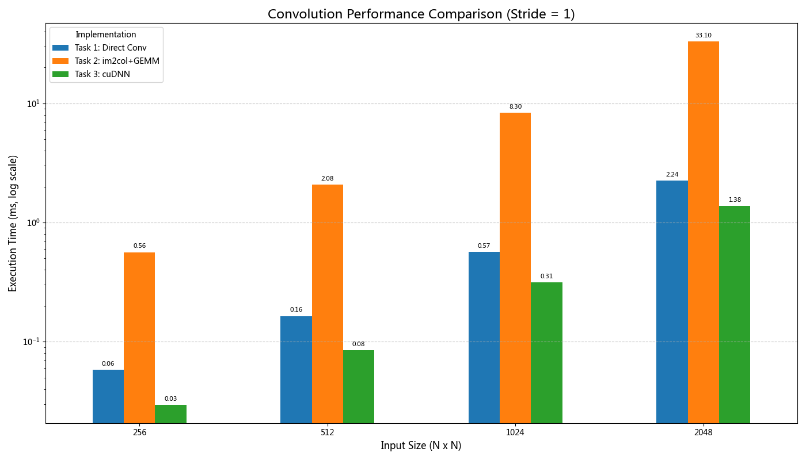
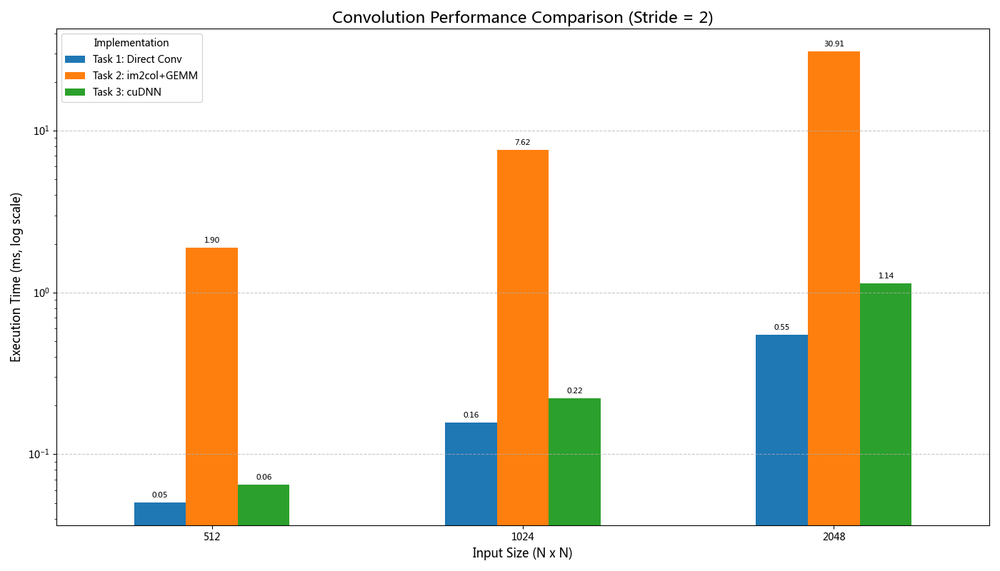
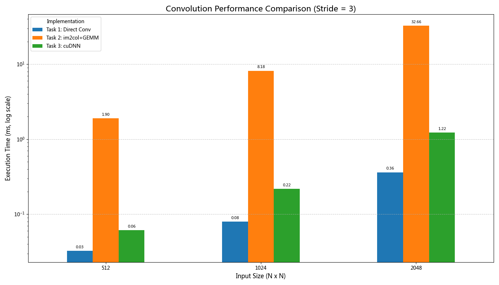

# 实验十一：基于 GPU 的卷积加速

## 一、 实验目标

本实验旨在探索和实现三种在 GPU 上进行二维卷积运算的方法，并对它们的性能进行测量和比较。具体目标如下：

1.  使用 CUDA 实现一个基础的直接卷积（滑窗法）。
2.  通过 `im2col` 技术将卷积运算转换为矩阵乘法（GEMM），并利用上次实验优化后的 GEMM 核函数进行计算。
3.  使用 NVIDIA 官方的高性能深度学习库 cuDNN 来执行卷积。
4.  对比分析三种方法的性能差异，并探讨自实现方法的潜在优化空间。

## 二、 实验环境

-   **操作系统**: Linux
-   **GPU**: NVIDIA GeForce RTX 4060 Ti
-   **CUDA 版本**: 11.8
-   **cuDNN 版本**: 9.x
-   **编译器**: nvcc

## 三、 实验实现

### 任务一：直接卷积（滑窗法）

#### 1. 实现原理与核心代码解析

直接卷积法是最直观的卷积实现。其原理类似于一个"滑窗"，让卷积核在输入特征图上按指定的步幅（stride）进行滑动。在每一个滑窗位置，计算卷积核与对应输入区域的元素级乘积之和，得到输出特征图中的一个像素点。

`conv2d_kernel` CUDA 核函数是该方法的核心。其并行策略是将输出特征图的计算任务分配给不同的线程。
- **线程与输出映射**：每个 CUDA 线程负责计算输出矩阵中的一个像素点 `(out_x, out_y)`。线程索引通过 `blockIdx`, `blockDim`, `threadIdx` 计算得出：
  ```c++
  int out_x = blockIdx.x * blockDim.x + threadIdx.x;
  int out_y = blockIdx.y * blockDim.y + threadIdx.y;
  ```
- **感受野计算**：线程首先根据自己的输出坐标 `(out_y, out_x)` 和步幅、填充等参数，反算出其在输入矩阵中对应感受野的左上角坐标 `(in_base_y, in_base_x)`。
  ```c++
  int in_base_y = out_y * stride - padding;
  int in_base_x = out_x * stride - padding;
  ```
- **卷积累加**：接着，在一个三重循环中（遍历通道 `c`、卷积核高 `kh`、卷积核宽 `kw`），线程依次计算感受野内每个点与卷积核对应点的乘积，并累加到 `acc` 寄存器中。
- **边界检查**：在访存前，必须进行边界检查 `if (in_y >= 0 && in_y < input_h && in_x >= 0 && in_x < input_w)`，确保只读取输入图像有效区域内的数据，而忽略了概念上的填充区域。
- **访存模式**：此实现中的所有读写操作（读取输入数据、读取卷积核、写入输出数据）均直接访问全局内存。对于每个输出点，都需要从全局内存中读取 `channels * kernel_h * kernel_w` 个输入数据点，存在大量的访存冗余，这是该朴素实现的主要性能瓶颈。

#### 2. 性能测试

| 输入尺寸 (H=W) | 步幅 (Stride) | 计算时间 (ms) |
| :------------- | :------------ | :------------ |
| 256            | 1             | 0.06          |
| 512            | 1             | 0.17          |
| 1024           | 1             | 0.57          |
| 2048           | 1             | 2.24          |
| 512            | 2             | 0.06          |
| 1024           | 2             | 0.16          |
| 2048           | 2             | 0.55          |
| 512            | 3             | 0.03          |
| 1024           | 3             | 0.09          |
| 2048           | 3             | 0.36          |

### 任务二：im2col + GEMM 卷积

#### 1. 实现原理与核心代码解析

为了利用 GPU 在矩阵乘法（GEMM）上的高效率，`im2col` (image-to-column) 技术被广泛应用。该方法将卷积操作显式地分为两个计算密集型步骤：

1.  **数据重排 (im2col)**：
    `im2col_kernel` 核函数负责此步骤。它将输入特征图中所有被卷积核覆盖的区域（patch）提取出来，并将每个 patch 拉伸成一个列向量。所有这些列向量共同构成一个新的、巨大的中间矩阵（`col_buffer`）。该核函数的并行策略与直接卷积类似，每个线程同样负责一个输出点 `(out_y, out_x)`，但其工作不是计算，而是数据搬运。线程循环遍历 `channels`、`kernel_h` 和 `kernel_w`，从输入矩阵的对应位置读取数据，并根据精心设计的索引 `col_buffer_index = (c * kernel_h * kernel_w + kh * kernel_w + kw) * (out_h * out_w) + (out_y * out_w + out_x)`，将其写入 `col_buffer` 的正确位置。此操作将大量不连续的内存访问模式转换成对一个大矩阵的写入。然而，这个过程本身会产生巨大的全局内存读写流量，并且会实例化一个尺寸非常可观的 `col_buffer` 矩阵。

2.  **矩阵乘法 (GEMM)**：
    卷积核（权重）本身也被拉伸成一个行向量，多个卷积核构成权重矩阵 `(out_channels, in_channels * kernel_h * kernel_w)`。然后，这个权重矩阵与上一步生成的 `col_buffer` 矩阵 `((in_channels * kernel_h * kernel_w), (out_h * out_w))` 进行矩阵乘法。本次实验复用了 `lab10` 中实现的、基于共享内存分块（Tiling）优化的 `matrixMulShared` 核函数。这次乘法将卷积中原本零碎的乘加运算，转换成了一次大规模、高度并行、访存友好的矩阵运算，从而能更好地发挥 GPU 的计算潜力。

#### 2. 性能测试

| 输入尺寸 (H=W) | 步幅 (Stride) | 计算时间 (ms) |
| :------------- | :------------ | :------------ |
| 256            | 1             | 0.57          |
| 512            | 1             | 2.09          |
| 1024           | 1             | 8.30          |
| 2048           | 1             | 33.08         |
| 512            | 2             | 1.92          |
| 1024           | 2             | 7.61          |
| 2048           | 2             | 30.41         |
| 512            | 3             | 1.90          |
| 1024           | 3             | 7.69          |
| 2048           | 3             | 32.66         |

### 任务三：使用 cuDNN 实现卷积

#### 1. 实现原理与核心代码解析

此任务直接调用 NVIDIA 官方提供的 cuDNN 库来完成卷积。cuDNN 是一个为深度神经网络优化的 GPU 加速库，其内部包含了针对不同硬件和参数组合高度优化的卷积算法。其编程范式是声明式的，用户通过"描述符（Descriptor）"来定义计算的各个方面。

使用 cuDNN 的主要步骤在代码 `cudnn_conv.cu` 中清晰体现：
1.  **初始化**: 创建一个 `cudnnHandle_t` 句柄，作为后续所有 cuDNN API 调用的上下文。
2.  **设置描述符**:
    *   `cudnnTensorDescriptor_t`: 为输入、输出数据创建并设置描述符。`cudnnSetTensor4dDescriptor` 定义了张量的维度（N, C, H, W）、数据类型（`CUDNN_DATA_FLOAT`）和内存布局（`CUDNN_TENSOR_NCHW`）。
    *   `cudnnFilterDescriptor_t`: 为卷积核创建并设置描述符，定义其维度（K, C, FH, FW）、类型和布局。
    *   `cudnnConvolutionDescriptor_t`: 为卷积操作本身创建描述符。`cudnnSetConvolution2dDescriptor` 定义了填充（Padding）、步幅（Stride）、卷积模式（`CUDNN_CROSS_CORRELATION`，这正是神经网络中常用的模式）等超参数。
3.  **选择最优算法**: 这是 cuDNN 的核心优势之一。调用 `cudnnFindConvolutionForwardAlgorithm()`，cuDNN会根据之前设置的描述符、GPU 硬件型号等信息，从多种内置卷积算法（如 `Implicit-GEMM`, `FFT`, `Winograd` 等）中自动测试并选择一个预期性能最快的算法。
4.  **工作空间管理**: 某些高效算法需要一块临时的显存作为"工作空间（workspace）"。通过 `cudnnGetConvolutionForwardWorkspaceSize()` 查询所选算法需要的工作空间大小，并为其分配显存。
5.  **执行卷积**: 调用 `cudnnConvolutionForward()`，传入所有句柄、描述符、数据指针和工作空间指针，以极高的效率执行计算。

#### 2. 性能测试

| 输入尺寸 (H=W) | 步幅 (Stride) | 计算时间 (ms) |
| :------------- | :------------ | :------------ |
| 256            | 1             | 0.03          |
| 512            | 1             | 0.08          |
| 1024           | 1             | 0.31          |
| 2048           | 1             | 1.47          |
| 512            | 2             | 0.07          |
| 1024           | 2             | 0.22          |
| 2048           | 2             | 1.14          |
| 512            | 3             | 0.06          |
| 1024           | 3             | 0.22          |
| 2048           | 3             | 1.23          |

## 四、 性能比较与分析

| 输入尺寸, 步幅 | Task 1: Direct Conv (ms) | Task 2: im2col+GEMM (ms) | Task 3: cuDNN (ms) |
| :------------- | :----------------------- | :----------------------- | :----------------- |
| 256x256, S=1   | 0.060                    | 0.570                    | 0.030              |
| 512x512, S=1   | 0.166                    | 2.089                    | 0.085              |
| 1024x1024, S=1 | 0.569                    | 8.301                    | 0.311              |
| 2048x2048, S=1 | 2.241                    | 33.079                   | 1.471              |
| 512x512, S=2   | 0.057                    | 1.918                    | 0.071              |
| 1024x1024, S=2 | 0.165                    | 7.614                    | 0.221              |
| 2048x2048, S=2 | 0.547                    | 30.408                   | 1.145              |
| 512x512, S=3   | 0.034                    | 1.897                    | 0.061              |
| 1024x1024, S=3 | 0.087                    | 7.686                    | 0.215              |
| 2048x2048, S=3 | 0.362                    | 32.661                   | 1.226              |

**分析**:
1.  **im2col+GEMM 的陷阱**: 从数据中可以清晰地看到，我们实现的 `im2col+GEMM` (Task 2) 性能远逊于朴素的直接卷积 (Task 1)，性能差距在一个数量级以上。这与"im2col是高效卷积方法"的普遍认知相悖。根本原因在于 `im2col` 这个数据重排步骤的实现非常低效。它在全局内存中显式地创建了一个巨大的中间矩阵 `col_buffer`。以 2048x2048 输入为例，`col_buffer` 的大小约为 `3 * 3 * 3 * 2048 * 2048 * sizeof(float) ≈ 450 MB`。生成这个矩阵需要大量的全局内存读写，其开销完全掩盖了后续优化过的 GEMM 所带来的性能优势。这给我们一个深刻的教训：在GPU编程中，一个看似优雅的算法转换，如果引入了过多的数据移动和全局内存流量，其性能可能会变得非常糟糕。

2.  **cuDNN 的绝对优势 (大部分情况)**: 当步幅为 1 时，cuDNN (Task 3) 在所有尺寸上都展现了最佳性能。这验证了 cuDNN 作为业界标准库的卓越性，其原因在于：
    *   **自动算法选择**: cuDNN 能根据输入、硬件等条件，动态选择理论最优或接近最优的算法（如 Winograd, FFT, Implicit-GEMM），而我们的实现是固定的。
    *   **底层硬件优化**: cuDNN 的核函数由 NVIDIA 工程师使用底层汇编语言（SASS）为特定 GPU 架构手工调优，可以最大化地利用硬件资源（如 Tensor Cores），这是我们在 CUDA C++ 层面难以企及的。
    *   **高效内存管理**: 专业的 cuDNN 算法（如 `implicit-GEMM`）可以在不显式生成 `col_buffer` 的情况下完成计算，极大地减少了内存占用和带宽压力。

3.  **直接卷积的意外胜利**: 一个非常有趣的发现是，当步幅（Stride）增大到 2 或 3 时，我们实现的朴素直接卷积（Task 1）在所有测试尺寸上都**反超**了 cuDNN。这可能是因为：
    *   **计算量锐减**: 更大的步幅意味着输出特征图的尺寸显著减小，总计算量（FLOPs）大幅下降。
    *   **开销占比变化**: 当计算量减少后，cuDNN 寻找最优算法、设置描述符、调用核函数等固定开销（overhead）在总时间中的占比变大。相比之下，直接卷积的实现非常简单，启动开销极小。在这种"计算/开销"比较低的情况下，简单直接的方法反而显现出优势。这表明，不存在某种"万能"的最优算法，针对具体且固定的应用场景，一个轻量级的定制内核有时能取得意想不到的效果。

## 五、 性能可视化图表


_图1：步幅为1时，三种卷积实现的性能对比（纵轴为对数刻度）_


_图2：步幅为2时，三种卷积实现的性能对比（纵轴为对数刻度）_


_图3：步幅为3时，三种卷积实现的性能对比（纵轴为对数刻度）_

## 六、 可能的改进方法

虽然我们的实现与 cuDNN 差距巨大，但仍有优化空间：

1.  **任务一 (直接卷积)**：
    *   **共享内存**: 最关键的优化。可以将输入数据的一个图块（Tile）加载到共享内存中，让一个线程块内的所有线程复用这部分数据，从而大幅减少对全局内存的访问，这是提升性能的核心。
    *   **寄存器优化**: 增加每个线程使用的寄存器数量，缓存更多中间计算结果。

2.  **任务二 (im2col+GEMM)**：
    *   **im2col 优化**: 当前的性能瓶颈在于 `im2col`。需要实现一个更高效的 `im2col` 核函数，例如引入共享内存来减少全局内存的读写次数。终极优化是实现 `implicit-im2col`，在 GEMM 计算中动态计算输入数据地址，完全避免生成中间矩阵。
    *   **GEMM 优化**: 我们复用的 `matrixMulShared` 核函数还可以进一步优化，例如采用更大的分块、实现双缓冲（在计算的同时预取下一块数据）来隐藏内存延迟。

## 七、 实验总结

通过本次实验，我成功实现了三种不同的 GPU 卷积方法，并通过性能对比深刻体会到了算法选择和底层优化对程序性能的巨大影响。实验结果清晰地表明，一个 naive 的高级别算法转换（如本例中的 im2col+GEMM）如果实现不当，其开销可能超过带来的收益。同时，与 cuDNN 的比较也让我认识到，工业级的专业计算库背后蕴含着极其深入的硬件理解和算法优化，它们是实现极致性能的基石。这次实验不仅锻炼了我的 CUDA 编程能力，也加深了我对 GPU 并行计算优化策略的理解。
