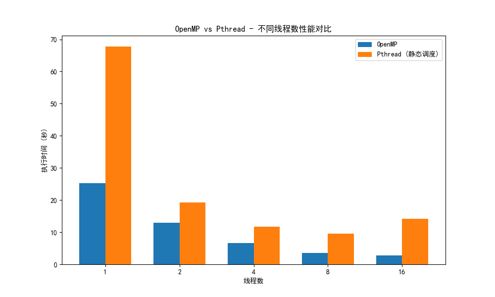
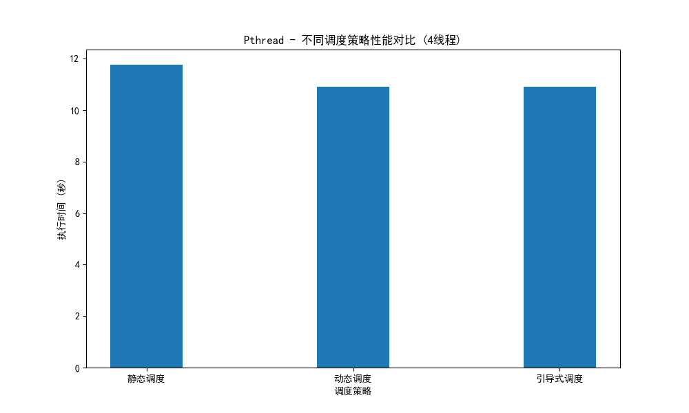
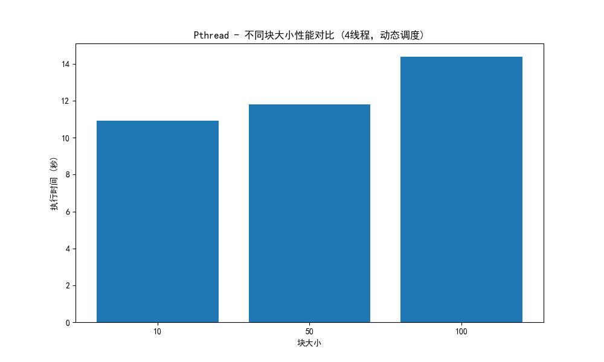

# 实验报告

## 1. 实验目的

- 理解并掌握规则网格上热传导问题的数值解法。
- 学习 OpenMP 并行程序的结构与调度方式。
- 掌握 pthreads 线程编程方法，能够用 pthreads 实现并行计算。
- 设计并实现通用的 parallel_for 并行循环结构，支持多种调度策略。
- 对比分析 OpenMP 与 pthreads 在不同线程数、调度方式下的性能差异。

## 2. 实验过程和核心代码

### 问题描述
本实验模拟二维规则网格上的热传导稳态问题，核心迭代公式为：
$$
w_{i,j}^{t+1} = \frac{1}{4}(w_{i-1,j}^t + w_{i+1,j}^t + w_{i,j-1}^t + w_{i,j+1}^t)
$$
边界条件如 heated_plate_openmp.c 所示。

### parallel_for 并行结构
实验实现了一个通用的 parallel_for 并行循环，支持静态（static）、动态（dynamic）、引导式（guided）三种调度策略。其接口如下：
```c
void parallel_for(int start, int end, int inc,
                 void *(*functor)(int, void*), void *arg, 
                 int num_threads, ScheduleType schedule_type, int chunk_size);
```
每个线程通过 functor 回调处理分配到的循环区间。

### Pthreads 并行实现
将 heated_plate_openmp.c 改造为 heated_plate_pthread.c，主要变化：
- 用 parallel_for 替换 OpenMP 的并行 for。
- 支持命令行参数指定线程数、调度方式和块大小。
- 用 pthread_mutex_t 保证多线程下最大差异 diff 的安全更新。
- 计时方式采用 clock_gettime(CLOCK_MONOTONIC)，保证 wall clock 时间准确。

核心代码片段如下：
```c
// 以并行方式设置边界
parallel_for(0, N, 1, set_boundary_top, &data, num_threads, schedule_type, chunk_size);
// 以并行方式迭代求解
while (epsilon <= data.diff) {
    parallel_for(0, M, 1, copy_solution, &data, num_threads, schedule_type, chunk_size);
    parallel_for(1, M-1, 1, compute_solution, &data, num_threads, schedule_type, chunk_size);
    data.diff = 0.0;
    parallel_for(1, M-1, 1, compute_diff, &data, num_threads, schedule_type, chunk_size);
}
```

### 编译与运行
- 编译：`make` 或 `gcc -o src/heated_plate_pthread src/heated_plate_pthread.c src/parallel_for.c -lpthread -lm`
- 运行：`./src/heated_plate_pthread 4 d 10`（4线程，动态调度，块大小10）
- OpenMP 参考：`make openmp`，`OMP_NUM_THREADS=4 ./reference/heated_plate_openmp`

## 3. 实验结果

详见 `reports/performance_report.txt`，主要结论如下：

### OpenMP vs Pthread 性能对比
| 线程数 | OpenMP时间(s) | Pthread时间(s) | 加速比 |
|-------|--------------|---------------|-------|
|   1   |   25.30      |   67.77       | 0.37  |
|   2   |   12.88      |   19.23       | 0.67  |
|   4   |   6.63       |   11.76       | 0.56  |
|   8   |   3.57       |   9.61        | 0.37  |
|  16   |   2.70       |   14.20       | 0.19  |

OpenMP 性能优于 pthreads



### 不同调度策略对比（4线程）
| 调度策略   | 执行时间(s) | 迭代次数 |
|------------|------------|---------|
| 静态调度   | 11.76      | 16955   |
| 动态调度   | 10.91      | 16955   |
| 引导式调度 | 10.91      | 16955   |

动态/引导式调度略优于静态调度。



### 不同块大小对比（4线程，动态调度）
| 块大小 | 执行时间(s) | 迭代次数 |
|--------|------------|---------|
| 10     | 10.91      | 16955   |
| 50     | 11.81      | 16955   |
| 100    | 14.39      | 16955   |

块大小过大时负载不均，性能下降。



### 最佳配置
8线程、引导式调度、块大小10时，Pthreads 版本最快：8.86秒。

## 4. 实验感想

本次实验让我深入理解了多线程并行编程的实际挑战。虽然 OpenMP 使用方便且性能更优，但通过手写 pthreads 和 parallel_for，我体会到线程调度、负载均衡、同步等底层机制的复杂性。尤其在实现动态/引导式调度时，需要合理设计互斥锁和任务分配策略。

调试过程中遇到最大差异 diff 线程安全问题，通过加锁解决。计时方式也从 clock() 改为 clock_gettime，保证了 wall clock 时间的准确性。

通过对比不同线程数、调度方式和块大小，发现合理的调度和参数选择对性能提升非常关键。实验也让我体会到高效并行库（如 OpenMP）背后隐藏了大量优化细节。

<!-- 可以写写过程中遇到的问题，你是怎么解决的。以及可以写你对此次实验的一些理解…… -->

---

# 附录：运行与测试说明

# 热平板并行模拟实验说明

## 目录结构
- `src/`：Pthreads 并行实现及 parallel_for 相关代码
- `reference/`：OpenMP 参考实现
- `reports/`：性能测试结果与对比图片
- `performance_analyzer.py`：自动化性能测试与报告生成脚本
- `report.md`：实验报告
- `requirement.md`：实验要求

## 编译方法

### 1. 编译 Pthreads 版本
```bash
make
# 或手动编译：
gcc -o src/heated_plate_pthread src/heated_plate_pthread.c src/parallel_for.c -lpthread -lm
```

### 2. 编译 OpenMP 参考版本
```bash
make openmp
# 或手动编译：
gcc -o reference/heated_plate_openmp reference/heated_plate_openmp.c -fopenmp -lm
```

## 运行方法

### 1. 运行 Pthreads 版本
```bash
./src/heated_plate_pthread [线程数] [调度方式] [块大小]
```
- 线程数：正整数，如 4、8
- 调度方式：s（静态 static）、d（动态 dynamic）、g（引导式 guided），如 s、d、g
- 块大小：正整数，决定每次分配给线程的任务块大小

**示例：**
```bash
./src/heated_plate_pthread 4 d 10   # 4线程，动态调度，块大小10
./src/heated_plate_pthread 8 g 50   # 8线程，引导式调度，块大小50
```

### 2. 运行 OpenMP 版本
```bash
export OMP_NUM_THREADS=4
./reference/heated_plate_openmp
```

## 性能测试与自动化分析

可使用 `performance_analyzer.py` 脚本自动测试不同线程数、调度方式和块大小下的性能，并生成对比图和报告。

```bash
python3 performance_analyzer.py
```
- 运行后将在 `reports/` 目录下生成：
  - `performance_report.txt`：详细性能数据与分析
  - `thread_comparison.png`：不同线程数性能对比图
  - `schedule_comparison.png`：不同调度策略性能对比图
  - `chunk_comparison.png`：不同块大小性能对比图

## 结果查看
- 详细实验结果和分析见 `reports/performance_report.txt` 和 `report.md`
- 主要性能对比图见 `reports/` 目录

## 其他
- 清理编译产物：
```bash
make clean
```
- 如需修改参数或调度策略，可直接编辑命令行参数或修改源代码后重新编译。