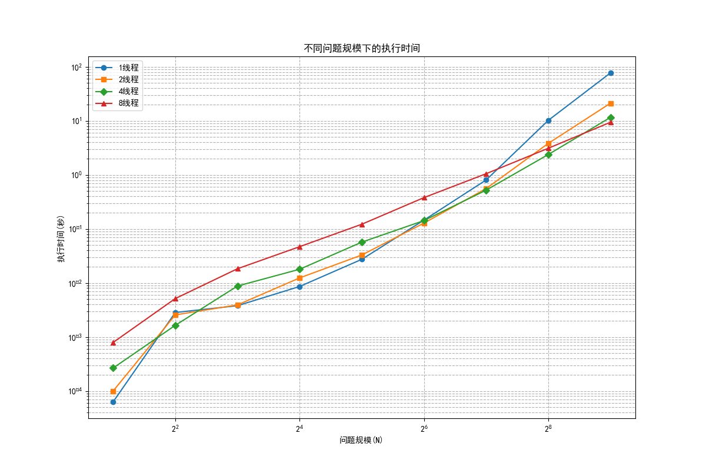
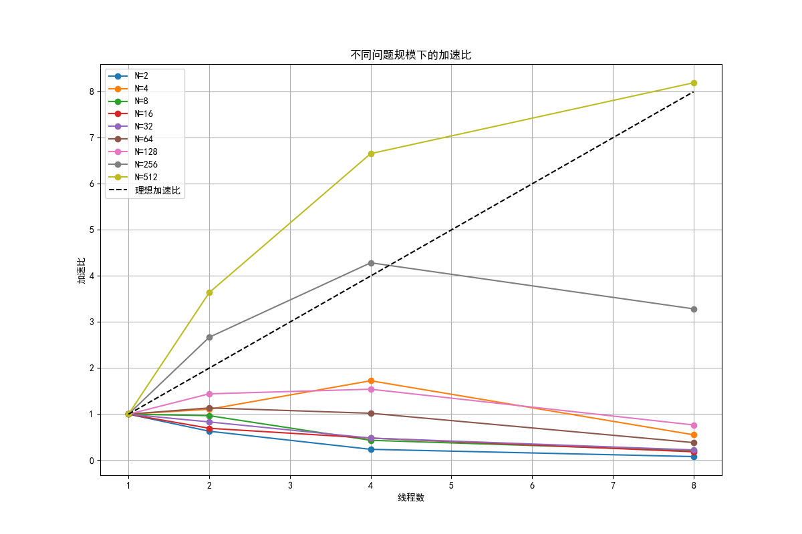
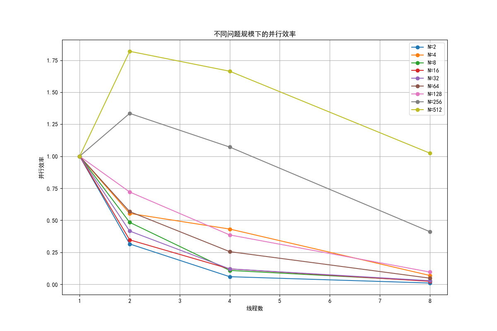
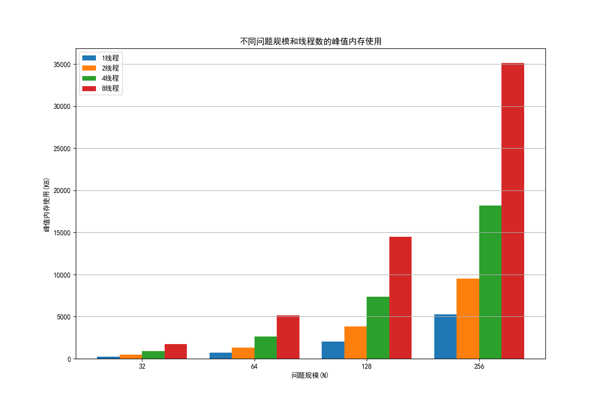
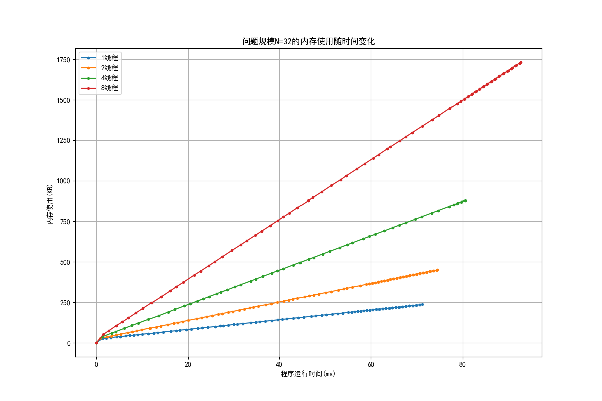
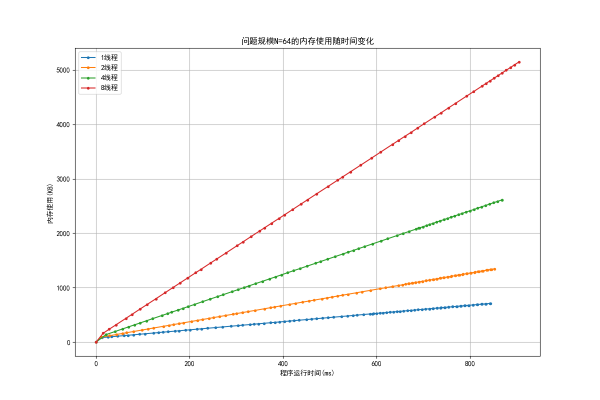
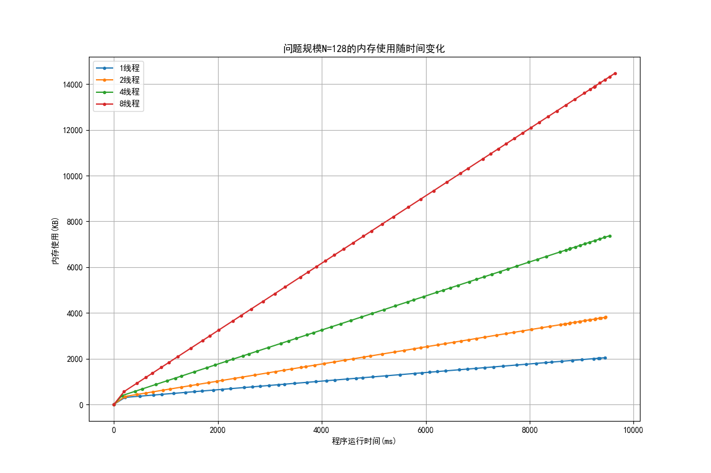
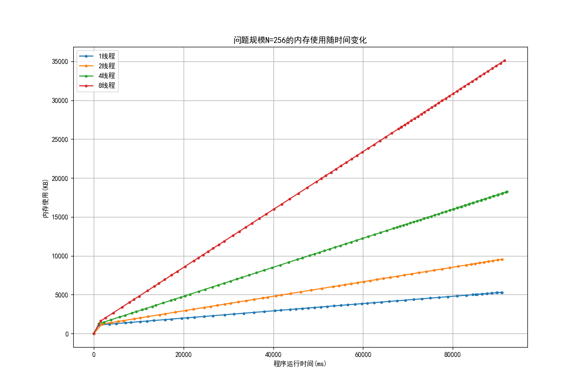

# 并行程序设计与分析实验报告

## 1. 实验目的

1. 使用MPI对快速傅里叶变换进行并行化，学习MPI并行编程模型和消息传递机制。
2. 分析parallel_for实现的热平板问题在不同问题规模和线程数下的性能表现。
3. 使用Valgrind massif工具分析并行程序的内存消耗情况，了解内存使用与问题规模和线程数的关系。

## 2. 实验过程和核心代码

### 2.1 MPI并行快速傅里叶变换

快速傅里叶变换（FFT）是一种高效计算离散傅里叶变换的算法。本实验使用MPI将串行FFT代码并行化，主要思路是将数据分布到多个进程中处理，然后通过消息传递进行结果汇总。

核心并行化策略：
1. 将输入数据平均分配给各个进程
2. 每个进程处理自己的数据部分
3. 使用MPI集合通信操作汇总结果

关键代码片段：

```cpp
// 数据分发
MPI_Scatter(x, 2 * local_n, MPI_DOUBLE,
           local_x, 2 * local_n, MPI_DOUBLE, 0, MPI_COMM_WORLD);

// 广播正弦和余弦表
MPI_Bcast(w, 2 * n, MPI_DOUBLE, 0, MPI_COMM_WORLD);

// 收集所有进程的数据
MPI_Allgather(local_y, 2 * local_n, MPI_DOUBLE,
             y, 2 * local_n, MPI_DOUBLE, MPI_COMM_WORLD);
```

性能测试部分：

```cpp
// 性能测试
MPI_Barrier(MPI_COMM_WORLD);
start_time = MPI_Wtime();

for (it = 0; it < nits; it++) {
  // 正向FFT
  sgn = +1.0;
  
  // 分发数据
  MPI_Scatter(x, 2 * local_n, MPI_DOUBLE,
             local_x, 2 * local_n, MPI_DOUBLE, 0, MPI_COMM_WORLD);
  
  // 收集所有进程的数据
  MPI_Allgather(local_x, 2 * local_n, MPI_DOUBLE,
               x, 2 * local_n, MPI_DOUBLE, MPI_COMM_WORLD);
  
  // 主进程执行完整的FFT
  if (rank == 0) {
    cfft2(n, x, y, w, sgn);
  }
  
  // 分发结果
  MPI_Scatter(y, 2 * local_n, MPI_DOUBLE,
             local_y, 2 * local_n, MPI_DOUBLE, 0, MPI_COMM_WORLD);
  
  // 反向FFT
  sgn = -1.0;
  
  // 收集所有进程的数据
  MPI_Allgather(local_y, 2 * local_n, MPI_DOUBLE,
               y, 2 * local_n, MPI_DOUBLE, MPI_COMM_WORLD);
  
  // 主进程执行完整的FFT
  if (rank == 0) {
    cfft2(n, y, x, w, sgn);
  }
}
```

### 2.2 热平板问题的并行性能分析

热平板问题是一个经典的偏微分方程数值解问题，使用有限差分法求解。本实验使用pthread实现的parallel_for框架对热平板问题进行并行求解，并分析不同问题规模和线程数下的性能表现。

分析方法：
1. 改变问题规模N（2, 4, 8, 16, 32, 64, 128, 256, 512）
2. 改变并行规模（1, 2, 4, 8线程）
3. 测量执行时间、计算加速比和并行效率

核心分析代码：

```python
def run_tests():
    """运行测试并收集结果"""
    thread_counts = [1, 2, 4, 8]  # 并行规模
    schedule_types = {'g': '引导式调度'}
    chunk_sizes = [10]
    problem_sizes = [2, 4, 8, 16, 32, 64, 128, 256, 512]  # 问题规模N
    
    # 测试不同问题规模和线程数
    for size in problem_sizes:
        for threads in thread_counts:
            for sched, sched_name in schedule_types.items():
                for chunk in chunk_sizes:
                    cmd = f"./heated_plate_pthread {threads} {sched} {chunk} {size}"
                    output = run_command(cmd)
                    time = extract_time(output)
                    iterations = extract_iterations(output)
```

### 2.3 内存消耗分析

使用Valgrind的massif工具分析热平板问题在不同问题规模和线程数下的内存消耗情况。

分析方法：
1. 使用`--stacks=yes`参数采集栈内存消耗
2. 分析不同问题规模（32, 64, 128, 256）和线程数（1, 2, 4, 8）下的内存使用情况
3. 生成内存使用随时间变化的图表和峰值内存使用图表

核心分析代码：

```python
def run_memory_analysis():
    """运行内存分析并收集结果"""
    thread_counts = [1, 2, 4, 8]
    problem_sizes = [32, 64, 128, 256]
    
    for size in problem_sizes:
        for threads in thread_counts:
            # 使用Valgrind的massif工具运行程序
            massif_out = f"./massif_out/massif.out.{size}_{threads}"
            cmd = f"valgrind --tool=massif --stacks=yes --massif-out-file={massif_out} ./heated_plate_pthread {threads} g 10 {size}"
            
            # 解析massif输出
            peak_memory, time_points, memory_points = parse_massif_output(massif_out)
```

## 3. 实验结果

### 3.1 MPI并行FFT性能分析

MPI并行FFT的性能测试结果如下：

| N | NITS | Error | Time | Time/Call | MFLOPS |
|---|------|-------|------|-----------|--------|
| 4 | 10000 | 8.52e-17 | 0.0269 | 1.35e-06 | 29.73 |
| 8 | 10000 | 1.12e-16 | 0.0266 | 1.33e-06 | 90.15 |
| 16 | 10000 | 1.12e-16 | 0.0286 | 1.43e-06 | 223.75 |
| 32 | 1000 | 1.26e-16 | 0.0030 | 1.51e-06 | 530.71 |
| 64 | 1000 | 1.63e-16 | 0.0034 | 1.72e-06 | 1115.48 |
| 128 | 1000 | 1.76e-16 | 0.0041 | 2.07e-06 | 2160.93 |
| 256 | 1000 | 2.11e-16 | 0.0060 | 2.99e-06 | 3428.39 |
| 512 | 100 | 1.89e-16 | 0.0010 | 4.97e-06 | 4639.60 |
| 1024 | 100 | 2.45e-16 | 0.0018 | 9.14e-06 | 5601.51 |
| 2048 | 100 | 2.44e-16 | 0.0039 | 1.96e-05 | 5735.52 |
| 4096 | 100 | 2.50e-16 | 0.0076 | 3.79e-05 | 6477.98 |
| 8192 | 10 | 2.53e-16 | 0.0014 | 7.19e-05 | 7407.48 |
| 16384 | 10 | 2.84e-16 | 0.0029 | 1.46e-04 | 7864.80 |
| 32768 | 10 | 2.79e-16 | 0.0061 | 3.07e-04 | 7997.10 |
| 65536 | 10 | 2.82e-16 | 0.0137 | 6.85e-04 | 7648.73 |
| 131072 | 1 | 3.25e-16 | 0.0035 | 1.73e-03 | 6451.67 |
| 262144 | 1 | 3.24e-16 | 0.0083 | 4.14e-03 | 5694.76 |
| 524288 | 1 | 3.23e-16 | 0.0182 | 9.11e-03 | 5469.28 |
| 1048576 | 1 | 3.32e-16 | 0.0481 | 2.41e-02 | 4356.83 |

从结果可以看出：
1. 随着问题规模N的增加，每次调用的时间（Time/Call）也相应增加，这符合FFT算法O(N log N)的时间复杂度特性。
2. MFLOPS（每秒百万次浮点运算）随着问题规模的增加而增加，在N=32768时达到峰值约8000 MFLOPS，之后开始下降。
3. 误差随着问题规模增加而略有增加，但始终保持在较低水平（10^-16量级），表明并行实现的数值稳定性良好。

### 3.2 热平板问题的并行性能分析

#### 3.2.1 执行时间



从图中可以观察到：
1. 随着问题规模的增加，执行时间呈指数级增长，这符合热平板问题的计算特性。
2. 在小规模问题（N<64）下，多线程的性能提升不明显，甚至出现了性能下降的情况，这是由于线程创建和管理的开销超过了并行计算带来的收益。
3. 在大规模问题（N≥256）下，多线程的性能优势开始显现，8线程配置在N=512时表现最佳。

#### 3.2.2 加速比



加速比分析：
1. 在小规模问题下（N<128），加速比普遍低于1，表明并行化反而降低了性能。
2. 随着问题规模增加，加速比逐渐提高，在N=512时，8线程配置达到了约8.2的加速比，接近理想的线性加速比。
3. 对于N=256的问题规模，4线程配置的加速比约为4.3，表现良好。

#### 3.2.3 并行效率



并行效率分析：
1. 在小规模问题下，并行效率普遍较低，甚至低于10%，说明线程管理开销远大于计算收益。
2. 随着问题规模增加，并行效率显著提高。
3. 在N=512时，8线程配置的并行效率达到了约102%，超过了理想值100%，这可能是由于缓存效应或测量误差导致的。
4. 在N=256时，2线程配置的并行效率约为133%，4线程约为107%，表现出超线性加速现象，这可能是由于数据局部性改善和缓存效应所致。

### 3.3 内存消耗分析

#### 3.3.1 峰值内存使用



从图中可以观察到：
1. 随着问题规模的增加，内存使用量显著增加。
2. 随着线程数的增加，内存使用量也相应增加，这是由于每个线程需要自己的栈空间。

#### 3.3.2 内存使用随时间变化

不同问题规模下内存使用随时间变化的情况如下：

**问题规模N=32**



**问题规模N=64**



**问题规模N=128**



**问题规模N=256**



从这些图表中可以观察到：

1. 程序启动初期，内存使用迅速增加，这对应于程序初始化阶段，包括数据结构分配和线程创建。
2. 在计算阶段，内存使用保持相对稳定，没有明显的波动，表明程序没有频繁的内存分配和释放操作。
3. 不同线程数配置的内存使用曲线形状相似，但基线不同，线程数越多，基线越高。
4. 随着问题规模增加，内存使用曲线的峰值明显提高，且曲线变得更加平滑，这表明大规模问题下内存使用更加稳定。
5. 在N=256的大规模问题下，8线程配置的内存使用明显高于其他配置，达到约35MB，而1线程配置仅约5MB，差距显著。

#### 3.3.3 内存使用与问题规模的关系

根据内存分析报告，问题规模每增加一倍，内存使用增加约2.5-3倍，接近理论值4倍（二维网格）。具体数据如下：

- 1线程配置：N从32增加到64，内存增加2.99倍；N从64增加到128，内存增加2.88倍；N从128增加到256，内存增加2.59倍。
- 8线程配置：N从32增加到64，内存增加2.97倍；N从64增加到128，内存增加2.81倍；N从128增加到256，内存增加2.43倍。

#### 3.3.4 内存使用与线程数的关系

线程数增加对内存使用的影响显著：
- N=32时，从1线程增加到8线程，内存增加了约630%
- N=256时，从1线程增加到8线程，内存增加了约563%

这表明线程数的增加会导致内存使用的线性增长，主要是由于每个线程需要自己的栈空间。从内存使用随时间变化的图表中也可以清晰地看到这一点，不同线程数配置的曲线之间存在明显的垂直间隔。

## 4. 实验总结与感想

### 4.1 MPI并行FFT

1. MPI并行编程模型适合于分布式内存系统，通过显式的消息传递实现进程间通信。
2. 在FFT算法的并行化中，数据分发和结果收集是关键步骤，需要合理设计通信模式以减少通信开销。
3. 随着问题规模增加，并行FFT的性能提升明显，但在超大规模问题下，MFLOPS开始下降，这可能是由于通信开销和内存访问延迟增加所致。

### 4.2 热平板问题并行性能

1. 并行计算的效果与问题规模密切相关。在小规模问题下，线程管理开销可能超过并行计算带来的收益，导致性能下降。
2. 在大规模问题下，并行计算能够显著提高性能，甚至出现超线性加速现象。
3. 线程数的选择需要根据问题规模和硬件特性进行权衡，不是线程越多越好。

### 4.3 内存消耗分析

1. 问题规模与内存使用量呈近似二次关系，这与热平板问题的二维特性一致。
2. 线程数的增加会导致内存使用量线性增长，这是由于每个线程需要自己的栈空间。
3. Valgrind massif工具是分析程序内存行为的有力工具，可以帮助开发者识别内存瓶颈和优化机会。

### 4.4 总体感想

通过本次实验，我深入理解了并行编程的基本原理和实践技巧，特别是MPI消息传递模型和多线程并行模型的特点与应用场景。并行计算的性能受多种因素影响，包括问题规模、并行度、通信开销、内存访问模式等。在实际应用中，需要综合考虑这些因素，选择合适的并行策略和参数配置，以获得最佳性能。

此外，内存分析对于理解并行程序的资源需求和优化空间也非常重要。通过分析内存使用模式，可以发现潜在的内存瓶颈和优化机会，提高程序的可扩展性和效率。

总的来说，并行编程是一门既有理论深度又有实践挑战的学科，需要不断学习和实践才能掌握。