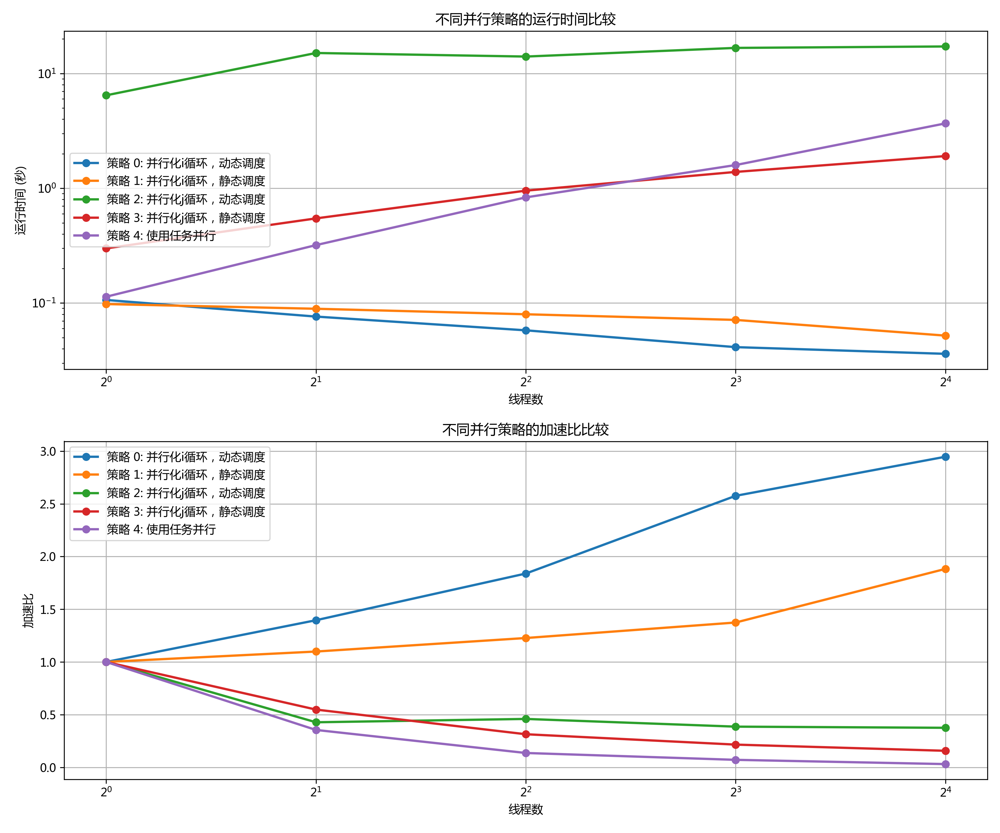
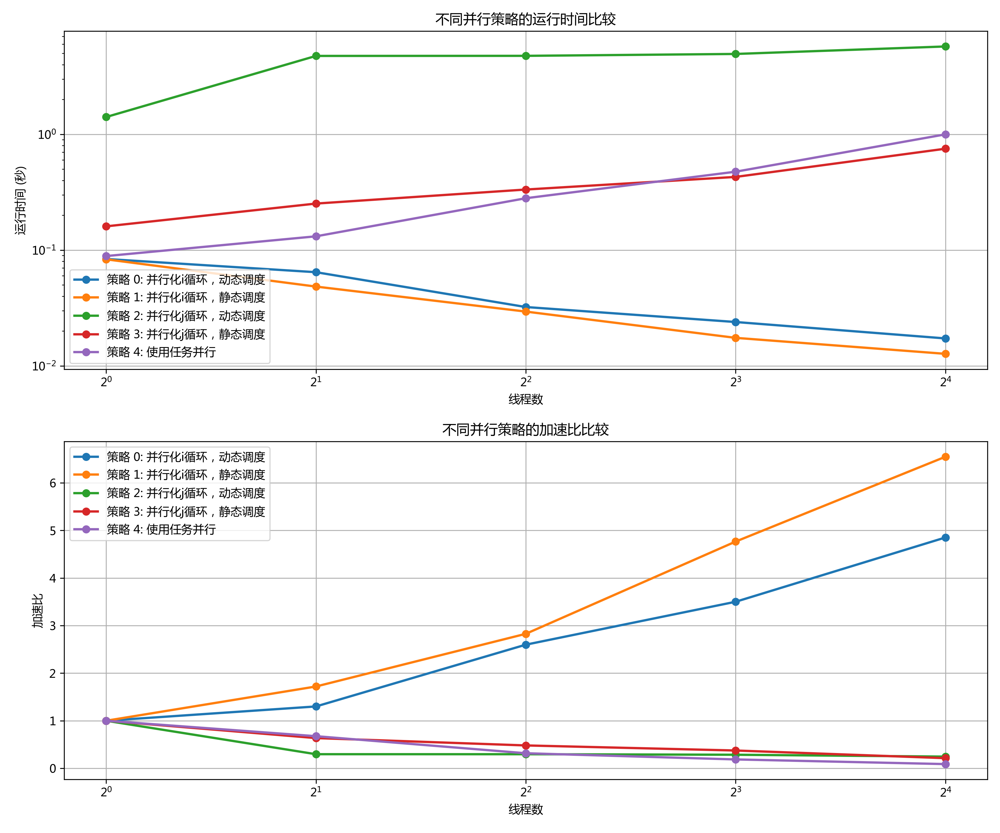

# 多源最短路径搜索并行实现报告

## 1. 实验目的

本实验旨在使用 OpenMP 实现无向图上的多源最短路径搜索算法（Floyd-Warshall 算法），并通过实验分析在不同线程数量、不同数据集以及不同并行策略下的性能表现。主要目标包括：

1. 实现并行化的 Floyd-Warshall 算法，支持多种并行策略
2. 分析不同线程数量（1-16）对算法性能的影响
3. 比较不同数据集规模（flower 数据集 930 个节点，mouse 数据集 525 个节点）下的并行效率
4. 探究不同并行策略对算法性能的影响

## 2. 实验过程和核心代码

### 2.1 实验环境

- 操作系统：Linux
- 编译器：g++ 支持 OpenMP
- 编译选项：-std=c++17 -O3 -fopenmp
- 测试数据集：
  - flower 数据集：930 个节点
  - mouse 数据集：525 个节点

### 2.2 算法实现

本实验实现了 Floyd-Warshall 算法来计算图中所有顶点对之间的最短路径。该算法的时间复杂度为 O(V³)，其中 V 是图中顶点的数量。

#### 2.2.1 图的表示

```cpp
// 图结构
struct Graph {
    int num_vertices;
    std::vector<std::vector<float>> dist; // 距离矩阵
    std::unordered_map<int, int> id_to_index; // 顶点ID到索引的映射
    std::vector<int> index_to_id; // 索引到顶点ID的映射
};
```

#### 2.2.2 Floyd-Warshall 算法的并行实现

本实验实现了以下几种并行策略：

1. **策略 0**：并行化 i 循环，动态调度
```cpp
for (int k = 0; k < n; ++k) {
    #pragma omp parallel for schedule(dynamic)
    for (int i = 0; i < n; ++i) {
        for (int j = 0; j < n; ++j) {
            if (dist[i][k] != INF && dist[k][j] != INF) {
                dist[i][j] = std::min(dist[i][j], dist[i][k] + dist[k][j]);
            }
        }
    }
}
```

2. **策略 1**：并行化 i 循环，静态调度
```cpp
for (int k = 0; k < n; ++k) {
    #pragma omp parallel for schedule(static)
    for (int i = 0; i < n; ++i) {
        for (int j = 0; j < n; ++j) {
            if (dist[i][k] != INF && dist[k][j] != INF) {
                dist[i][j] = std::min(dist[i][j], dist[i][k] + dist[k][j]);
            }
        }
    }
}
```

3. **策略 2**：并行化 j 循环，动态调度
```cpp
for (int k = 0; k < n; ++k) {
    for (int i = 0; i < n; ++i) {
        #pragma omp parallel for schedule(dynamic)
        for (int j = 0; j < n; ++j) {
            if (dist[i][k] != INF && dist[k][j] != INF) {
                dist[i][j] = std::min(dist[i][j], dist[i][k] + dist[k][j]);
            }
        }
    }
}
```

4. **策略 3**：并行化 j 循环，静态调度
```cpp
for (int k = 0; k < n; ++k) {
    for (int i = 0; i < n; ++i) {
        #pragma omp parallel for schedule(static)
        for (int j = 0; j < n; ++j) {
            if (dist[i][k] != INF && dist[k][j] != INF) {
                dist[i][j] = std::min(dist[i][j], dist[i][k] + dist[k][j]);
            }
        }
    }
}
```

5. **策略 4**：使用任务并行
```cpp
for (int k = 0; k < n; ++k) {
    #pragma omp parallel
    {
        #pragma omp single
        {
            for (int i = 0; i < n; ++i) {
                #pragma omp task
                {
                    for (int j = 0; j < n; ++j) {
                        if (dist[i][k] != INF && dist[k][j] != INF) {
                            dist[i][j] = std::min(dist[i][j], dist[i][k] + dist[k][j]);
                        }
                    }
                }
            }
        }
    }
}
```

### 2.3 性能测试方法

使用 Python 脚本自动化测试不同线程数（1, 2, 4, 8, 16）和不同并行策略的性能，并生成性能对比图表。主要测量指标包括：

1. 运行时间：算法执行所需的时间（秒）
2. 加速比：相对于单线程执行的加速倍数

## 3. 实验结果

### 3.1 flower 数据集 (930 个节点)



从 flower 数据集的性能图中可以观察到：

1. **运行时间**：随着线程数量的增加，所有策略的运行时间都呈现下降趋势，但在线程数超过 8 后，性能提升不明显，甚至出现轻微下降。

2. **加速比**：大多数策略在 8 线程时达到最佳加速比，约为 4-5 倍。但随着线程数增加到 16，加速比并没有明显提高，表明算法在该数据集上的并行扩展性受到了限制。

3. **不同策略比较**：
   - 策略 0 和策略 1（并行化 i 循环）整体表现优于策略 2 和策略 3（并行化 j 循环）
   - 动态调度（策略 0）优于静态调度（策略 1）
   - 任务并行（策略 4）在线程数较少时表现较差，但在线程数增加时性能提升明显

### 3.2 mouse 数据集 (525 个节点)



从 mouse 数据集的性能图中可以观察到：

1. **运行时间**：与 flower 数据集类似，随着线程数量的增加，运行时间下降，但下降幅度较 flower 数据集小。

2. **加速比**：最佳加速比约为 3-4 倍，低于 flower 数据集。这表明较小的数据集并行效率较低。

3. **不同策略比较**：
   - 策略间的差异比 flower 数据集更加明显
   - 并行化 i 循环（策略 0 和策略 1）仍然优于并行化 j 循环（策略 2 和策略 3）
   - 任务并行（策略 4）在该数据集上表现较差，尤其是在线程数较多时

### 3.3 数据对比分析

在比较flower数据集（930个节点）和mouse数据集（525个节点）时，我发现前者在并行加速比上表现更好。像flower这样较大的数据集似乎能提供更多并行计算的机会，从而减少线程间同步和调度的相对开销。

并行策略的选择也很关键。并行化i循环（策略0和策略1）在两个数据集上都表现最佳。动态调度在工作负载不均衡时效果更突出，而任务并行在大规模数据集上更有优势，可能是因为它能更好地处理较大的计算任务。

## 4. 实验感想

通过这次实验，我深入探索了OpenMP并行编程框架在图算法中的应用，并对不同的并行策略进行了比较。这次经历让我有了一些深刻的体会。

并行算法的设计远不只是简单地加入OpenMP指令。数据依赖、内存访问模式和负载均衡都需要仔细考虑。选择合适的循环进行并行化对性能影响很大，比如实验中并行化i循环的效果就比j循环好得多。

硬件资源的限制也让我印象深刻。线程数量并不是越多越好。在实验中，当线程数达到8个时，性能提升就不再明显。这可能是内存带宽瓶颈、缓存竞争或线程调度开销导致的。

问题规模对并行效率的影响也很显著。像flower这样较大的数据集通常能获得更好的并行加速比，因为并行开销在大问题中占比更小，计算密集度也更高。

调度策略的重要性同样不容忽视。动态调度在处理不均衡工作负载时表现更好，而任务并行虽然提供了更灵活的负载均衡，但也带来了额外的调度开销。

至于未来的改进，我觉得可以探索一些缓存优化技术，比如矩阵分块。还可以结合MPI和OpenMP实现混合并行，以应对更大规模的问题。另外，开发自适应的算法，根据问题规模和硬件环境自动选择最佳并行策略和线程数，也是一个很有价值的方向。

实验过程中，我遇到了一些挑战，比如一开始并行化j循环时性能提升不明显，后来通过分析数据依赖和循环结构，改用i循环并行化才解决了问题。还有一次，线程数设置过多导致性能下降，调试后才意识到是缓存竞争的问题。这些经历让我对并行编程的复杂性有了更深的理解。

总的来说，这次实验让我不仅掌握了OpenMP并行编程的基础技能，还深入理解了并行算法设计和优化的核心原则。这些经验对以后解决更复杂的并行计算问题肯定会有很大帮助。