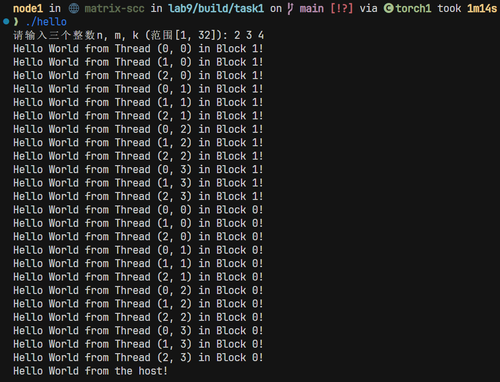
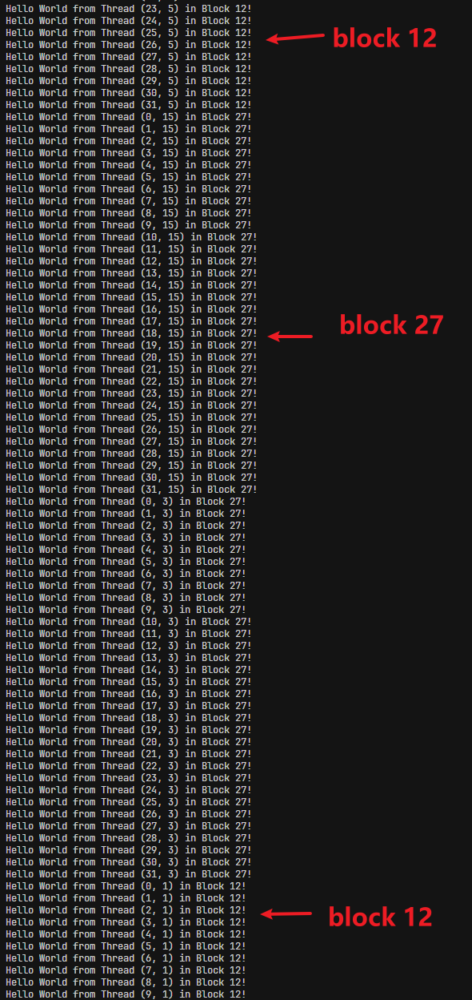
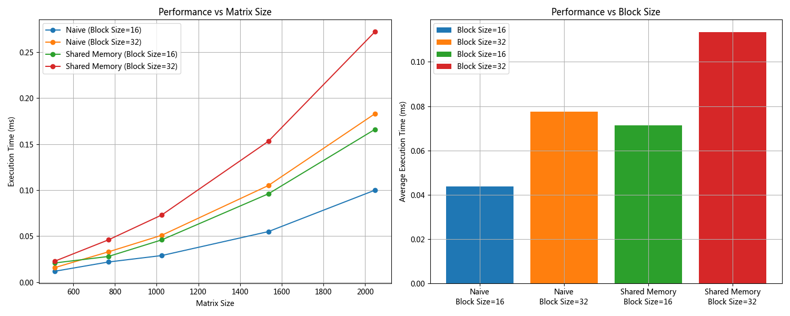

# CUDA并行编程实验报告

## 1. 实验目的

本实验旨在通过两个CUDA编程任务，深入理解GPU并行计算的基本概念和优化技术：

1. 通过CUDA Hello World程序，理解CUDA线程模型和线程块的组织方式，观察并行执行的特性。
2. 通过矩阵转置程序，掌握CUDA程序性能优化的关键技术，包括：
   - 线程块大小的选择
   - 矩阵规模对性能的影响
   - 不同访存方式的性能差异
   - 任务/数据划分策略的优化

## 2. 实验过程和核心代码

### 2.1 CUDA Hello World



在CUDA Hello World实验中，创建了一个简单的核函数，让每个线程输出自己的位置信息。

理论上，CUDA 中的线程是 并行执行 的（包括多线程、多线程块）。

printf() 在每个线程中被调用，但线程间没有同步机制，所以输出会根据 执行顺序/调度顺序 乱序 地写入输出缓冲区。

然而，上图中似乎输出的顺序是固定有规律的

扩大数据量，可以观察到乱序输出的证据



### 2.2 CUDA矩阵转置

#### 2.2.1 并行转置原理

矩阵转置的基本操作是将矩阵A的第i行j列元素移动到转置矩阵A^T的第j行i列位置。在CUDA中，我们可以通过以下方式实现并行转置：

1. 每个线程负责一个元素的转置
2. 使用二维线程块和网格来匹配矩阵的二维结构
3. 通过不同的访存策略优化性能

#### 2.2.2 两种转置核函数的实现

1. **基础版本（transposeNaive）**：
```cpp
__global__ void transposeNaive(float *input, float *output, int n) {
    int x = blockIdx.x * blockDim.x + threadIdx.x;
    int y = blockIdx.y * blockDim.y + threadIdx.y;
    
    if (x < n && y < n) {
        output[y * n + x] = input[x * n + y];
    }
}
```
- 直接进行全局内存访问
- 每个线程负责一个元素的转置
- 实现简单，访存模式清晰

2. **共享内存优化版本（transposeShared）**：
```cpp
__global__ void transposeShared(float *input, float *output, int n) {
    __shared__ float tile[32][32];
    
    int x = blockIdx.x * blockDim.x + threadIdx.x;
    int y = blockIdx.y * blockDim.y + threadIdx.y;
    
    if (x < n && y < n) {
        tile[threadIdx.y][threadIdx.x] = input[y * n + x];
    }
    
    __syncthreads();
    
    x = blockIdx.y * blockDim.x + threadIdx.x;
    y = blockIdx.x * blockDim.y + threadIdx.y;
    
    if (x < n && y < n) {
        output[y * n + x] = tile[threadIdx.x][threadIdx.y];
    }
}
```
- 使用共享内存作为中间缓存
- 通过tile缓存减少全局内存访问
- 需要同步屏障确保数据一致性

## 3. 实验结果

### 3.1 性能分析



### 3.2 性能优化效果

通过实验，我观察到不同因素如何影响性能。线程块大小是个关键点，16×16的线程块在各种矩阵规模下表现得更好，可能是因为它能更高效地利用GPU资源。相比之下，32×32的线程块有时会引发资源竞争和调度开销。矩阵规模也很重要，规模越大并行效率越高。小矩阵容易受到内存传输开销的拖累，而大矩阵能充分发挥GPU的并行能力。

访存方式上，基础版本的性能出乎意料地优于共享内存版本。共享内存虽然减少了全局内存访问，但额外的同步开销却让它的优势打了折扣。基础版本的访存模式更直接，似乎更容易被GPU优化。任务和数据划分方面，二维线程块结构跟矩阵操作的匹配度更高。共享内存的tile策略虽然理论上不错，但实现起来复杂，同步屏障的开销也抵消了它的好处。

在优化过程中，基础版本的核函数在大多数情况下表现更好。共享内存版本虽然理论上能减少内存访问，实际性能却不如预期。简单的实现往往更可靠。线程块大小上，16×16依然是最佳选择，避免了过大线程块带来的资源竞争。

## 4. 实验感想

这次实验让我对CUDA并行编程的核心概念和优化技巧有了更深的理解。我逐渐明白了CUDA的线程层次结构，搞清楚了线程块和网格的组织方式，也意识到并行执行中存在的不确定性。性能优化上，简单的实现往往更有效，线程块大小的选择对结果影响很大，而共享内存这类技术需要仔细权衡利弊。

实验中遇到了一些意外。比如，我一开始以为共享内存版本会表现更好，但结果却相反。后来分析发现，同步开销抵消了它的优势。

**另外，刚开始性能测试的时候，观察不到明显的性能差别，特别是第一个实验速度特别慢，后来意识到这是没有预热GPU导致的。**

未来，我想探索更多访存优化的策略，研究更高效的线程块组织方式，或许还可以试试向量化加载或存储指令。这次实验让我认识到，在GPU编程中，过度优化可能适得其反，简单的方案反而更实用。这些经验对我以后做GPU加速计算的项目肯定会有很大帮助。